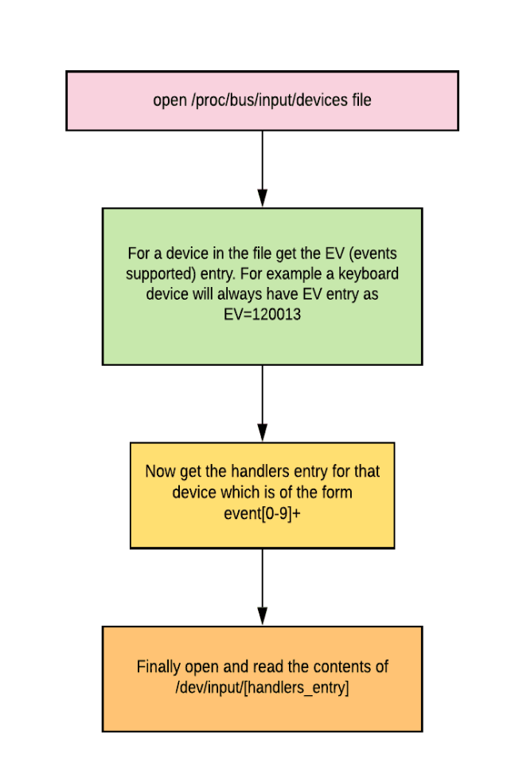

# Keylogger
A keylogger for Linux in Python

Once the script starts, all key presses are logged into an output file, until the script is stopped.

EDIT: All keypresses are emailed to specified address (default: self) depending on entered buffer size.

# Design

The diagram describes the general mechanism for fetching event info for all devices.

Currently only fetching event info from a keyboard is supported. 